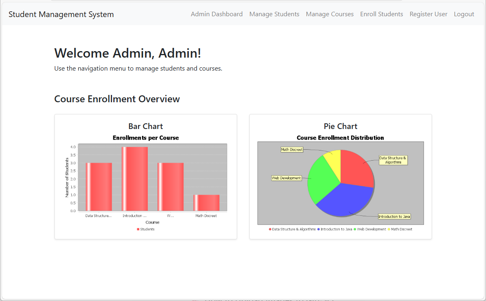
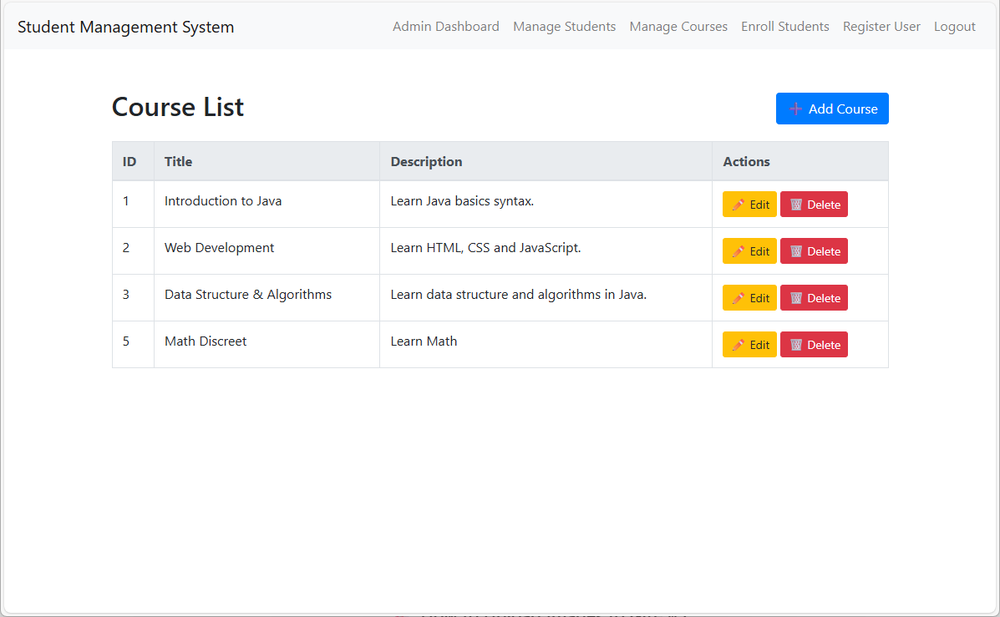

|JUST FOR LEARNING PURPOSES |
# 🎓 Student Management System (JSP & Servlets)

A simple web-based Student Management System built using **Java EE (JSP & Servlets)**, styled with **Bootstrap**, and powered by a **MySQL** backend.

This project supports role-based access (Admin & Student), course management, enrollment functionality, chart visualization, and PDF/CSV export features.

---

## 🛠️ Technologies Used

| Technology     | Description                      |
|----------------|----------------------------------|
| Java           | Backend programming language     |
| JSP / Servlets | Web rendering and controllers    |
| MySQL          | Relational database              |
| Bootstrap      | Front-end styling                |
| JFreeChart     | Chart rendering for dashboard    |
| iText          | PDF generation                   |
| Argon2         | Secure password hashing          |
| NetBeans       | IDE for development              |

---

## 🚀 Features

### 👨‍💼 Admin

- Secure login (with Argon2)
- Create, update, and delete courses
- View enrolled students and export to PDF/CSV
- View real-time enrollment charts (bar + pie)
- Register new students or admins

### 👨‍🎓 Student

- Role-based session and navigation
- View registered courses

### 📊 Charts

- Bar Chart: Students per Course
- Pie Chart: Enrollment Distribution

### 📄 Export

- Export student list to **CSV**
- Export full student/enrollment report to **PDF** (including charts)

---

## 🧱 Project Structure

```
StudentManagement/
├── Web Pages/
│   ├── index.jsp
│   ├── login.jsp
│   ├── navbar.jsp
│   ├── admin/
│   │   └── AdminHome.jsp, register-user.jsp
│   ├── course/
│   │   └── add-course.jsp, edit-course.jsp, list-courses.jsp
│   ├── student/
│   │   └── enroll-student.jsp, list-students.jsp, dashboard.jsp
│   └── WEB-INF/
│       ├── web.xml
├── Source Packages/
│   ├── controller/
│   │   ├── LoginServlet.java, LogoutServlet.java, RegisterUserServlet.java
│   │   ├── controller.course/
│   │   │   └── AddCourseServlet, EditCourseServlet, etc.
│   │   ├── controller.student/
│   │   │   └── StudentDashboardServlet, ExportStudentCSVServlet, etc.
│   │   ├── controller.chart/
│   │   │   └── EnrollmentChartServlet, EnrollmentPieChartServlet
│   │   └── InitDataServlet.java ✅
│   ├── dao/
│   │   └── UserDAO.java, StudentDAO.java, CourseDAO.java, DBUtil.java
│   └── model/
│       └── User.java, Student.java, Course.java
├── db/
│   └── studentdb.sql
├── db.properties (excluded via .gitignore)
└── README.md
```

---

## ⚙️ Setup Instructions

### 1. Clone the repository

```bash
git clone https://github.com/your-username/StudentManagement.git
cd StudentManagement
```

### 2. Open in NetBeans

- File → Open Project → Select `StudentManagement`

### 3. Import Dependencies

Ensure the following libraries are added to your project:
- `itextpdf.jar`
- `jfreechart.jar`
- `argon2-jvm.jar` (or use Maven)


### 4. Configure MySQL

- Create a database named `studentdb`
- Run the SQL dump: `studentdb.sql` [`db/studentdb.sql`](db/studentdb.sql) to create tables and sample data.

#### Option A: Edit `db.properties`
Update the file with your actual MySQL credentials:

```properties
jdbc.url=jdbc:mysql://localhost:3306/studentdb
jdbc.username=databaseuser
jdbc.password=yourpassword
```

#### Option B: Use Environment Variables (No Code Changes)
You can also configure database settings via system environment variables:

- `DB_URL`
- `DB_USER`
- `DB_PASS`

✅ If these environment variables are present, you do **not** need to modify the `DBUtil.java` file.


🚫 **Note**: This file is ignored by Git using .gitignore and should be stored in a secure, non-public location.

---


### 5. Initialize Passwords (IMPORTANT)
To ensure the default users (e.g. admin/student) work with Argon2 hashes, run this URL in your browser before first login:

Use this URL if deployed with context (StudentManagement)
🔗 http://localhost:8080/StudentManagement/setup/init-data?token=secret123

Otherwise, use this URL if deployed as ROOT.war
🔗 http://localhost:8080/setup/init-data?token=secret123

This updates their passwords to `123456` using your backend's hashing logic.

💡 **Tip**: You may change the default password (`123456`) by editing the `InitDataServlet.java` file.


### 6. Deploy & Run

- Clean and build the project
- Deploy via NetBeans Tomcat or GlassFish
- Visit: [http://localhost:8080/StudentManagement](http://localhost:8080/StudentManagement)

---

## 📸 Screenshots

### Admin Dashboard


### Course List


🧪 Default logins:  
- Admin: `admin@admin.com` / `123456`  
- Student: `azrul@student.com` / `123456`

---

## 🔒 Security Notes

- Passwords are hashed using **Argon2** before storage.
- Session control and auto-expiry protect against unauthorized access.
- Admin-only operations are protected from frontend access.

---

## 📤 Export Features

- `/export/students.csv` — CSV export of student list
- `/export/students.pdf` — PDF export with embedded chart
- `/chart/enrollment-bar.png` — Bar chart
- `/chart/enrollment-pie.png` — Pie chart

---

## 📌 Notes
- `db.properties` is excluded from Git for security.
- Uses `request.getContextPath()` for portability.
- Protected pages require login session.

---

## 👨‍💻 Author

Fakhrul Zaki  
[LinkedIn](https://www.linkedin.com/in/fakhrul-adli-mohd-zaki-135b83344)
